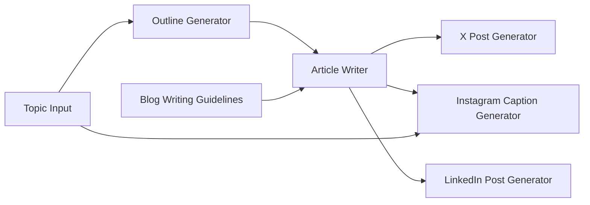

このレシピでは、トピック（およびオプションで画像）を入力すると、AIがアウトラインを作成し、完全なブログ記事を書き、その記事内容を元にX、Instagram、LinkedIn向けの最適化された投稿を並列で生成するアプリの作り方をご紹介します。

## 概要

**目的**: トピックからブログ記事を生成し、その記事内容を元にSNS投稿文を並列生成

| 使用ノード | 役割 | モデル |
|-----------|------|--------|
| App Request | トピック入力 + 画像（オプション） | - |
| テキストノード | 記事構成のプロンプト | - |
| ジェネレーター①（アウトライン） | 記事構成を生成 | gpt-5-nano |
| ジェネレーター②（本文） | アウトラインから本文生成 | claude-haiku-4.5 |
| ジェネレーター③（X） | 記事を元にX向け短文生成 | gpt-5-nano |
| ジェネレーター④（Instagram） | 記事を元にInstagram向けキャプション生成（画像対応） | gemini-2.5-flash-lite |
| ジェネレーター⑤（LinkedIn） | 記事を元にLinkedIn向けプロフェッショナル投稿生成 | claude-haiku-4.5 |

**学べる機能**: ノードの連鎖（順次処理）、並列処理、プロンプト設計、マルチモーダル入力（オプション）

## ワークフロー図



## ノード設定詳細

### 1. App Request

| 項目 | 値 |
|------|-----|
| ノード名 | `Topic Input` |
| ノード入力名 | `topic` |
| ファイル入力 | オプション（画像: PNG, JPEG, GIF, WebP） |
| プロンプト | - （ユーザー入力のみ） |

### 2. Text Node

| 項目 | 値 |
|------|-----|
| ノード名 | `Blog Writing Guidelines` |
| テキスト内容 | （以下参照） |

```
You are a professional blog writer. Follow these guidelines when creating content:
- Write in a clear, engaging, and informative tone
- Use headings and subheadings for better readability
- Include an introduction, main body, and conclusion
- Target length: 800-1200 words
- Make the content SEO-friendly with natural keyword usage
```

### 3. Generator Node（アウトライン）

| 項目 | 値 |
|------|-----|
| ノード名 | `Outline Generator` |
| モデル | gpt-5-nano |
| Thinking | OFF |
| Web Search | - |

**プロンプト:**
```
Create a detailed blog post outline for the following topic:

@Topic Input

Include:
1. A compelling title
2. Introduction hook
3. 3-5 main sections with subpoints
4. Conclusion summary
5. Call-to-action suggestion

Output the outline in a structured format.
```

### 4. Generator Node（記事本文）

| 項目 | 値 |
|------|-----|
| ノード名 | `Article Writer` |
| モデル | claude-haiku-4.5 |
| Thinking | ON |
| Web Search | OFF |

**プロンプト:**
```
Write a complete blog article based on the following outline:

@Outline Generator

Follow these writing guidelines:
@Blog Writing Guidelines

Make sure to:
- Expand each section with detailed, valuable content
- Use smooth transitions between sections
- Include relevant examples where appropriate
- Maintain a consistent voice throughout
```

### 5. Generator Node（X）

| 項目 | 値 |
|------|-----|
| ノード名 | `X Post Generator` |
| モデル | gpt-5-nano |
| Thinking | OFF |
| Web Search | - |

**プロンプト:**
```
Create a post for X (Twitter) to promote the following blog article:

@Article Writer

Requirements:
- Maximum 280 characters
- Highlight the key insight or hook from the article
- Engaging and concise
- Include 1-3 relevant hashtags
- Use a conversational tone
- Include a call-to-action to read the full article
```

### 6. Generator Node（Instagram）

| 項目 | 値 |
|------|-----|
| ノード名 | `Instagram Caption Generator` |
| モデル | gemini-2.5-flash-lite |
| Thinking | - |
| Web Search | OFF |

**プロンプト:**
```
Create an Instagram caption to promote the following blog article:

@Article Writer

Additional context (if image provided):
@Topic Input

Requirements:
- If an image is provided, analyze it and incorporate visual elements into the caption
- Summarize the article's key points in an engaging way
- Engaging opening line to hook readers
- Use line breaks for readability
- Include 5-10 relevant hashtags at the end
- Add 2-3 relevant emojis
- Include a call-to-action (e.g., "Link in bio to read the full article")
- Optimal length: 150-300 characters for the main text
```

### 7. Generator Node（LinkedIn）

| 項目 | 値 |
|------|-----|
| ノード名 | `LinkedIn Post Generator` |
| モデル | claude-haiku-4.5 |
| Thinking | OFF |
| Web Search | OFF |

**プロンプト:**
```
Create a LinkedIn post to promote the following blog article:

@Article Writer

Requirements:
- Professional and insightful tone
- Start with a hook or thought-provoking question from the article
- Summarize key takeaways from the article
- Use short paragraphs and line breaks for readability
- Include a clear lesson or insight
- End with a question to encourage engagement
- Optimal length: 1,300-2,000 characters
- No hashtags or limit to 3 professional ones
- Include a call-to-action to read the full article
```
