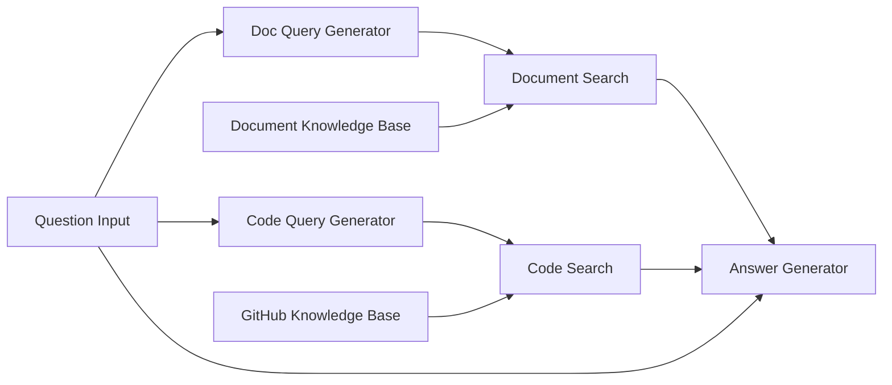

このレシピでは、複数のVector Storeを組み合わせた強力なRAG（検索拡張生成）ワークフローを構築するアプリの作り方をご紹介します。Document Vector StoreとGitHub Vector Storeをクエリ最適化と統合し、包括的なナレッジベースQ&Aを実現する方法を学びます。

## 概要

**目的**: 複数のVector Storeを組み合わせたRAGの仕組みを学ぶ

| 使用ノード | 役割 | モデル |
|-----------|------|--------|
| Document Vector Store | PDF/テキストをベクトル化 | text-embedding-3-small |
| GitHub Vector Store | コードをベクトル化 | text-embedding-3-small |
| App Entry | 質問入力 | - |
| ジェネレーター x2 | 検索クエリを最適化 | gpt-5-nano |
| Queryノード x2 | 関連情報を検索 | - |
| ジェネレーター | 検索結果から回答生成 | claude-haiku-4.5 |

**学べる機能**: RAG（検索拡張生成）、Document Vector Store、GitHub Vector Store、クエリ最適化、複数Queryノードの統合

## ワークフロー図



## ノード設定詳細

### 1. Document Vector Store

| 項目 | 値 |
|------|-----|
| ノード名 | `Document Knowledge Base` |
| エンベディングモデル | OpenAI text-embedding-3-small |

**事前にロードするファイル:**

| ファイル | ソースURL | 内容 |
|---------|-----------|------|
| `docs.giselles.ai-llms-full.txt` | `https://docs.giselles.ai/llms-full.txt` | ドキュメント（テキスト） |
| `giselles-terms.pdf` | `https://giselles.ai/legal/terms` | 利用規約 |
| `giselles-privacy.pdf` | `https://giselles.ai/legal/privacy` | プライバシーポリシー |

### 2. GitHub Vector Store

| 項目 | 値 |
|------|-----|
| ノード名 | `GitHub Knowledge Base` |
| リポジトリ | `giselles-ai/giselle` |
| コードを含める | ON |
| Issueを含める | ON |
| Pull Requestを含める | ON |
| エンベディングモデル | OpenAI text-embedding-3-small |

### 3. App Entry

| 項目 | 値 |
|------|-----|
| ノード名 | `Question Input` |
| ノード入力名 | `question` |
| プロンプト | - （ユーザー入力のみ） |

### 4. Generator Node（ドキュメントクエリ）

| 項目 | 値 |
|------|-----|
| ノード名 | `Doc Query Generator` |
| モデル | gpt-5-nano |
| Thinking | OFF |
| Web Search | - |

**プロンプト:**
```
Convert the following question into an optimized search query for documentation:

Question: @Question Input

Generate a query with relevant keywords and concepts for searching documentation.
Output only the query, nothing else.
```

### 5. Generator Node（コードクエリ）

| 項目 | 値 |
|------|-----|
| ノード名 | `Code Query Generator` |
| モデル | gpt-5-nano |
| Thinking | OFF |
| Web Search | - |

**プロンプト:**
```
Convert the following question into an optimized search query for code:

Question: @Question Input

Generate a query with function names, file patterns, and technical terms for searching code.
Output only the query, nothing else.
```

### 6. Query Node（ドキュメント）

| 項目 | 値 |
|------|-----|
| ノード名 | `Document Search` |
| ソース | `@Document Knowledge Base` |
| クエリ | `@Doc Query Generator` |
| 最大結果数 | 10 |
| 類似度しきい値 | 0.3 |

### 7. Query Node（GitHub）

| 項目 | 値 |
|------|-----|
| ノード名 | `Code Search` |
| ソース | `@GitHub Knowledge Base` |
| クエリ | `@Code Query Generator` |
| 最大結果数 | 10 |
| 類似度しきい値 | 0.3 |

### 8. Generator Node（回答）

| 項目 | 値 |
|------|-----|
| ノード名 | `Answer Generator` |
| モデル | claude-haiku-4.5 |
| Thinking | ON |
| Web Search | OFF |

**プロンプト:**
```
Answer the following question based on the provided content:

Question: @Question Input

Documentation:
@Document Search

Code & Repository:
@Code Search

Requirements:
- Answer based on both documentation and code repository content
- Reference specific files or passages when applicable
- If the answer is not found, clearly state that
- Be concise but thorough
```
