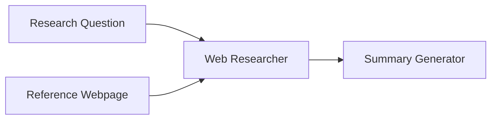

このレシピでは、固定の参照ページとLLMのWeb検索機能を組み合わせるアプリの作り方をご紹介します。質問を入力すると、AIが参照ドキュメントとリアルタイムのWeb検索の両方を使って包括的な回答を提供します。

## 概要

**目的**: 固定の参照ページとLLMのWeb検索を組み合わせてリサーチ

| 使用ノード | 役割 | モデル |
|-----------|------|--------|
| App Entry | 質問入力 | - |
| ウェブページノード | 固定URLから参照情報取得 | - |
| ジェネレーター①（リサーチ） | Web検索で情報収集 | claude-haiku-4.5 |
| ジェネレーター②（要約） | 調査結果をまとめる | gemini-2.5-flash-lite |

**学べる機能**: ウェブページノード、LLMのWeb Search機能、情報の組み合わせ

## ワークフロー図



## ノード設定詳細

### 1. App Entry

| 項目 | 値 |
|------|-----|
| ノード名 | `Research Question` |
| ノード入力名 | `question` |
| プロンプト | - （ユーザー入力のみ） |

### 2. Webpage Node

| 項目 | 値 |
|------|-----|
| ノード名 | `Reference Webpage` |
| URL | `https://docs.giselles.ai/llms-full.txt` |

### 3. Generator Node（Webリサーチャー）

| 項目 | 値 |
|------|-----|
| ノード名 | `Web Researcher` |
| モデル | claude-haiku-4.5 |
| Thinking | ON |
| Web Search | ON |

**プロンプト:**
```
Research the following question using web search and the reference page:

Question: @Research Question

Reference Information: @Reference Webpage

Requirements:
- Search the web for the latest and most relevant information
- Combine web search results with the reference page content
- Provide accurate and up-to-date answers
- Cite sources when possible
```

### 4. Generator Node（要約）

| 項目 | 値 |
|------|-----|
| ノード名 | `Summary Generator` |
| モデル | gemini-2.5-flash-lite |
| Thinking | - |
| Web Search | OFF |

**プロンプト:**
```
Summarize the research findings into a clear report:

@Web Researcher

Requirements:
- Executive summary (2-3 sentences)
- Key findings as bullet points
- Conclusion and recommendations
```
